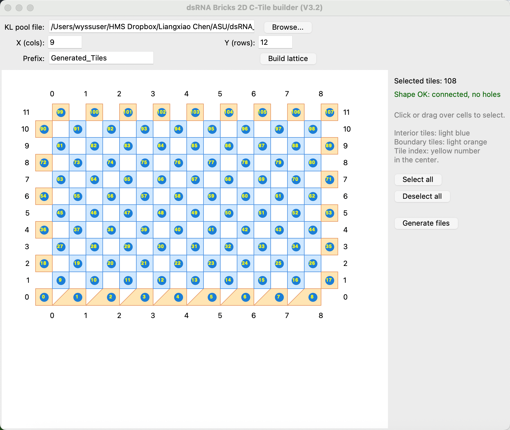
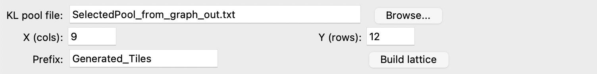
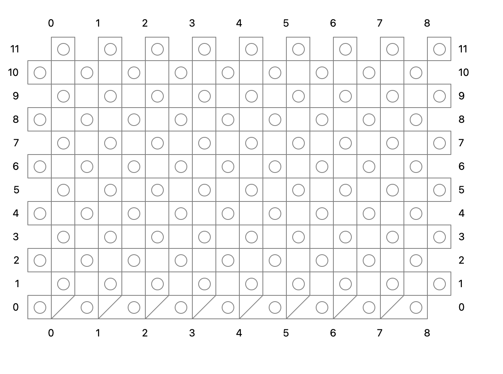
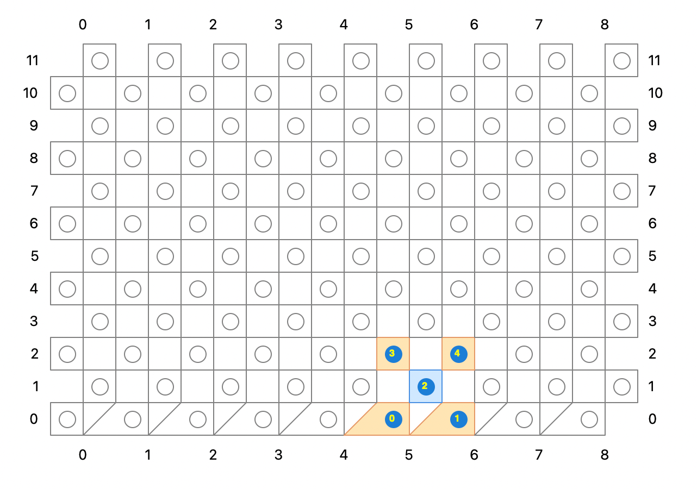
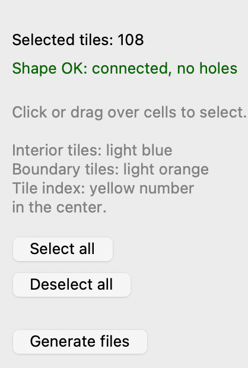

# dsRNA Bricks 2D C‑Tile Builder (V3.2)

A GUI tool for designing **2D dsRNA brick (C‑tile) lattices** with **arbitrary size and arbitrary shape**.  
Users interactively select tiles on a 2D lattice and export design files for downstream sequence design (e.g., NUPACK) and assembly documentation.

---

## Quick start

### Requirements
- Python 3.x
- GUI dependencies required by your environment (the script runs directly via Python).  
  If your environment uses conda, create/activate the corresponding environment first.

### Run
```bash
python build_dsRNA_Bricks_2D_CTileV3.2.py
```

---

## GUI overview



Top control panel:



### Inputs (top panel)
- **KL pool file**: the KL pool text file used as the building-block pool.  
  Example (from this repository):  
  `Orthogonal_sequence_selection/SelectedPool_from_graph_out.txt`
- **X (cols)**: number of tiles along the X direction (columns).
- **Y (rows)**: number of tiles along the Y direction (rows).
- **Prefix**: prefix used to name the exported output files.
- **Build lattice**: generate the lattice canvas with the specified X/Y dimensions.

### Lattice canvas
After clicking **Build lattice**, the tool generates a lattice canvas. Each circle corresponds to a tile position that can be clicked (or click‑dragged) to select/deselect tiles.

- **Boundary tiles** (seed / edge tiles): light orange
- **Interior tiles** (body tiles): light blue
- **Tile index**: yellow number shown at the center of each selected tile

Blank lattice example:



---

## Example walkthrough: 9 × 12 lattice (paper example)

This repository uses the **9 × 12** structure as a worked example.

### Step 1 — Choose KL pool file
Select the KL pool file. In this example, we use:
- `Orthogonal_sequence_selection/SelectedPool_from_graph_out.txt`

### Step 2 — Set lattice size (X, Y) and output prefix
- **X (cols)**: `9`
- **Y (rows)**: `12`
- **Prefix**: `Generated_Tiles`

### Step 3 — Build the lattice
Click **Build lattice** to generate the lattice:



### Step 4 — Select the shape
Click (or click‑drag) over cells to select the tiles that define your target shape.  
Selected tiles will be colored by type (boundary vs interior).

Partial selection example:



### Step 5 — Generate files
After the target shape is selected, click **Generate files**.  
The tool will export **three files** (example: 9 × 12 lattice with 108 selected tiles):

1. `Generated_Tiles_9x12_108_KL.txt`  
   KL pairing relationships used in the generated structure.

2. `Generated_Tiles_9x12_108_NUPACK.txt`  
   Input document for **NUPACK** sequence design.

3. `Generated_Tiles_9x12_108.txt`  
   Per‑tile information including tile geometry and secondary structure.

---

## Notes and best practices

- Keep the **KL pool** consistent with the orthogonality criteria used in your design pipeline.  
  The example pool in `Orthogonal_sequence_selection/SelectedPool_from_graph_out.txt` is provided for demonstration.
- For publication-quality reproducibility, commit:
  - The KL pool used
  - The GUI parameters (X, Y, Prefix)
  - The exported output files for the final structures (or at least a minimal example)

---

## Repository layout

- `Orthogonal_sequence_selection/`  
  Scripts and outputs for KL pool generation and orthogonal selection.
- `build_dsRNA_Bricks_2D_CTileV3.2.py`  
  The GUI tool described in this README.
- `examples/` (optional)  
  Example inputs/outputs for quick reproduction.
- `docs/images/`  
  README screenshots and figures.
