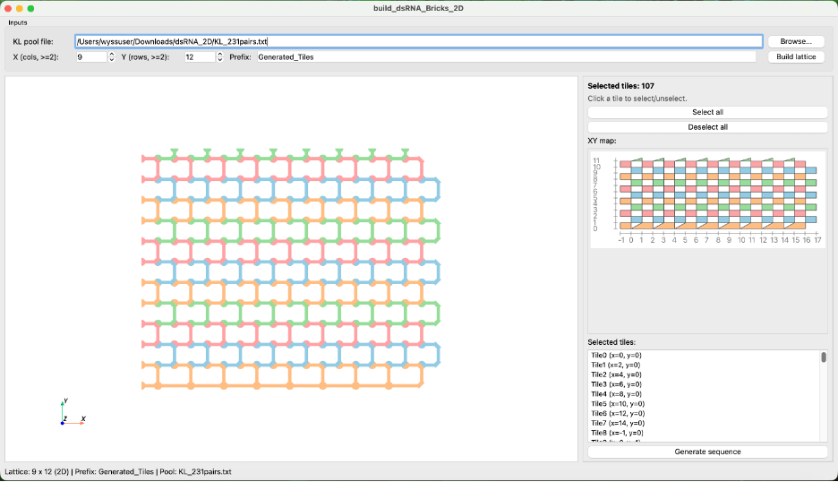
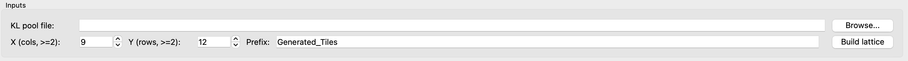
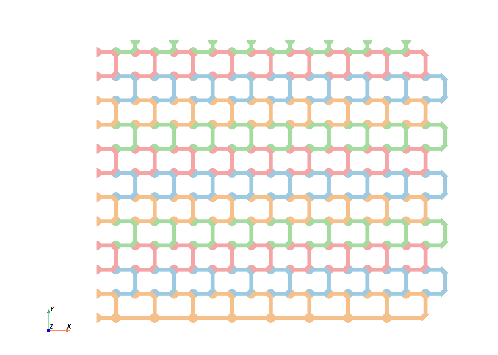
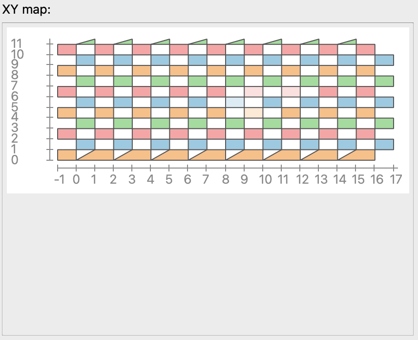
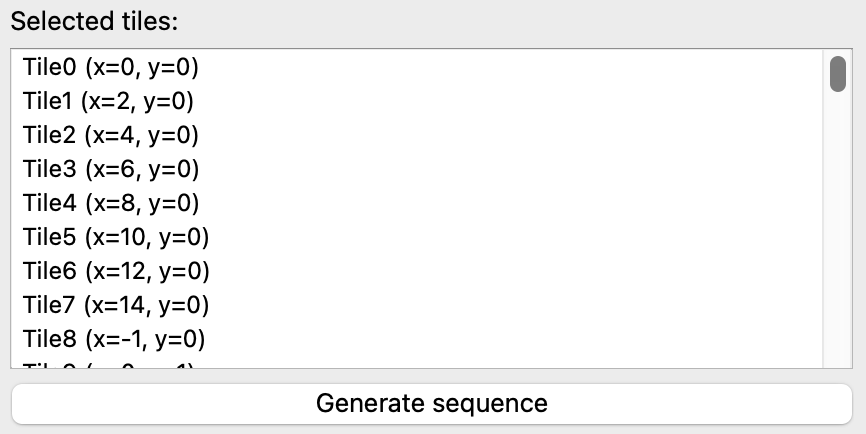
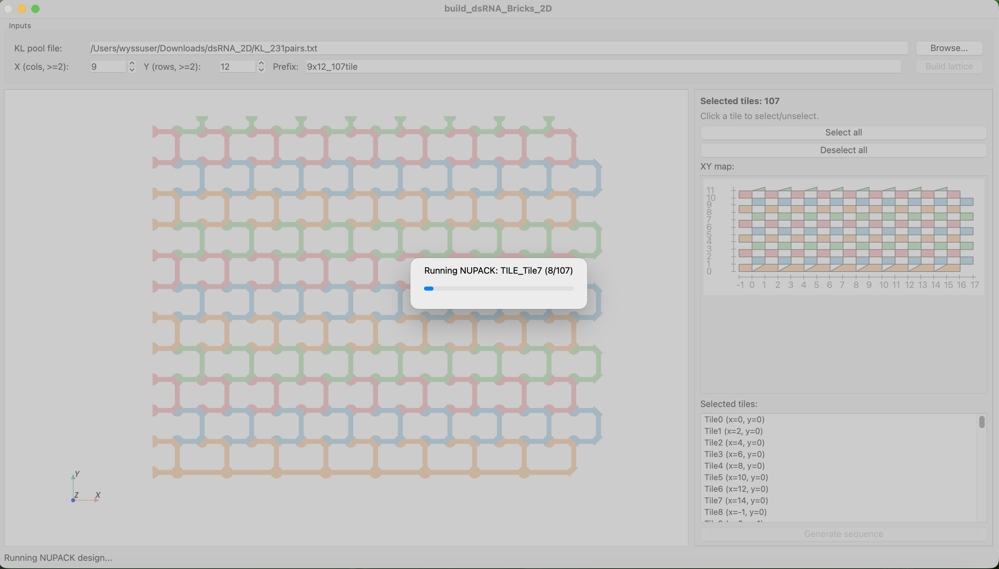
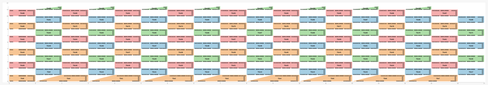

# Build 2D dsRNA Bricks

## Overview
This project is a Python GUI tool for building **2D dsRNA brick lattices** and generating tile sequences.

It supports:

- Loading a KL sequence-pool file.
- Building a 2D lattice from `X` and `Y` tile rules.
- Interactive tile selection from both 3D view and XY map.
- Sequence export + NUPACK design in one `Generate sequence` step.

Generated outputs:

- `<prefix>_tile_structure.txt`
- `<prefix>_2D_map.svg`
- `<prefix>_sequence.txt`

## Requirements
- Python `3.12` (tested)
- `PySide6==6.9.*` (recommended)
- `numpy`
- `pyvista`
- `pyvistaqt`
- `vtk` (tested with `9.5.2`)
- `nupack` (see [NUPACK docs](https://docs.nupack.org/))

Install example (conda + pip):

```bash
conda create -n dsrna python=3.12 -y
conda activate dsrna
pip install "pyside6==6.9.*" numpy pyvista pyvistaqt vtk
```

Quick check:

```bash
python -c "import PySide6, pyvista, pyvistaqt, vtk, numpy; print('PySide6', PySide6.__version__); print('PyVista', pyvista.__version__); print('VTK', vtk.vtkVersion.GetVTKVersion()); print('NumPy', numpy.__version__)"
```

## Run
From this folder:

```bash
python build_dsRNA_Bricks_2D.py
```

Alternative:

```bash
python -m function.build_dsRNA_Bricks_3D
```

## Project Layout
- `build_dsRNA_Bricks_2D.py`: launcher.
- `function/app.py`: main GUI window and workflow wiring.
- `function/lattice_builder.py`: 2D lattice/tile placement rules.
- `function/map2d.py`: XY map widget and selection sync.
- `function/view3d.py`: embedded PyVista view.
- `function/c_tiles.py`: tile geometry definitions.
- `function/rna_tile_generator.py`: tile RNA generation.
- `function/nupack_runner.py`: NUPACK execution pipeline.
- `KL_231pairs.txt`: example KL sequence-pool file.
- `demo_9x12_107tile/`: demo outputs.

## Workflow Example (9x12, 107 tiles)
> Put screenshots in `docs/Figure/` with the filenames used below.

1. Overview

   

2. Input panel

   - Select KL pool file (example: `KL_231pairs.txt`).
   - Set `X`, `Y`, and optional prefix.
   - Required KL-pair count must be <= pool size.

   Example pool lines:

   ```text
   CUAGAUGGA	GAUCUACCU
   UGUACCUUC	ACAUGGAAG
   UCAGAUUCG	AGUCUAAGC
   GCAUGAGUA	CGUACUCAU
   GCUCAUCUA	CGAGUAGAU
   UAGCCAUUC	AUCGGUAAG
   GUUAGAACG	CAAUCUUGC
   CCUUAGUUG	GGAAUCAAC
   ```

   

3. Model view

   - Left click: select/unselect tile.
   - Mouse wheel **or** hold right click + move up/down: zoom.
   - Hold middle click: pan/drag whole figure.

   

4. XY map (helix-position map)

   

5. Selected tiles panel

   

   Selection rules before sequence generation:

   - No flexible tiles: each selected tile must have at least 2 interactions with other selected tiles.
   - Single connected group only: selected tiles must form one connected component (no multiple closed groups).

6. Generate sequence

   - Click `Generate sequence`.
   - Pipeline runs: sequence generation -> SVG export -> NUPACK design.

   

## Output Example (`demo_9x12_107tile`)
1. 2D map SVG

   File: `demo_9x12_107tile/9x12_107tile_2D_map.svg`

   

2. Tile structure output

   File: `demo_9x12_107tile/9x12_107tile_tile_structure.txt`

   <details>
   <summary>First three tiles</summary>

   ```text
   *******TILE_Tile0*******
   GNNNNNNUNNNNNNA CUAGUGACA NNNNNNNUNNNNNNNGNC AAA GACGUAAGA GNUNNNNNNNGNNNNNNN ANNNNNNGNNNNNNC GNNNNNNGNNNA CAUGCAUAG NNNNNNNUNNNNNNNUNNNNNNNGNNNNNNNUNNNNNNNGNNNNNG AAA UCGAUCUAC CNNNNNUNNNNNNNGNNNNNNNUNNNNNNNGNNNNNNNGNNNNNNN ANNNUNNNNNNC UU CACGAAGUCAAUAC
   ((((((((((((((. ......... (((((((((((((((((( ... ......... )))))))))))))))))) .)))))))))))))) (((((((((((. ......... (((((((((((((((((((((((((((((((((((((((((((((( ... ......... )))))))))))))))))))))))))))))))))))))))))))))) .))))))))))) .. ..............

   *******TILE_Tile1*******
   CNNNNNNUNNNNNNA CCUUAGUUG NNNNNNNGNNNNNNNUNC AAA AACAGGAUG GNGNNNNNNNUNNNNNNN ANNNNNNGNNNNNNG CNNNNNNGNNNA GAUGUUAGC NNNNNNNGNNNNNNNUNNNNNNNUNNNNNNNUNNNNNNNUNNNNNC AAA GUACGUAUC GNNNNNGNNNNNNNGNNNNNNNGNNNNNNNGNNNNNNNUNNNNNNN ANNNUNNNNNNG UU CACGAAGUCAAUAC
   ((((((((((((((. ......... (((((((((((((((((( ... ......... )))))))))))))))))) .)))))))))))))) (((((((((((. ......... (((((((((((((((((((((((((((((((((((((((((((((( ... ......... )))))))))))))))))))))))))))))))))))))))))))))) .))))))))))) .. ..............

   *******TILE_Tile2*******
   CNNNNNNGNNNNNNA UCAGCUAAC NNNNNNNGNNNNNNNGNC AAA CAUGUGACU GNUNNNNNNNUNNNNNNN ANNNNNNUNNNNNNG GNNNNNNUNNNA CUUCACUGA NNNNNNNUNNNNNNNGNNNNNNNGNNNNNNNUNNNNNNNUNNNNNG AAA CUACAAUCG CNNNNNGNNNNNNNGNNNNNNNUNNNNNNNUNNNNNNNGNNNNNNN ANNNGNNNNNNC UU CACGAAGUCAAUAC
   ((((((((((((((. ......... (((((((((((((((((( ... ......... )))))))))))))))))) .)))))))))))))) (((((((((((. ......... (((((((((((((((((((((((((((((((((((((((((((((( ... ......... )))))))))))))))))))))))))))))))))))))))))))))) .))))))))))) .. ..............
   ```
   </details>

3. Final sequence output

   File: `demo_9x12_107tile/9x12_107tile_sequence.txt`

   <details>
   <summary>First three tiles</summary>

   ```text
   *******TILE_Tile0*******

   GNNNNNNUNNNNNNA CUAGUGACA NNNNNNNUNNNNNNNGNC AAA GACGUAAGA GNUNNNNNNNGNNNNNNN ANNNNNNGNNNNNNC GNNNNNNGNNNA CAUGCAUAG NNNNNNNUNNNNNNNUNNNNNNNGNNNNNNNUNNNNNNNGNNNNNG AAA UCGAUCUAC CNNNNNUNNNNNNNGNNNNNNNUNNNNNNNGNNNNNNNGNNNNNNN ANNNUNNNNNNC UU CACGAAGUCAAUAC

   ((((((((((((((. ......... (((((((((((((((((( ... ......... )))))))))))))))))) .)))))))))))))) (((((((((((. ......... (((((((((((((((((((((((((((((((((((((((((((((( ... ......... )))))))))))))))))))))))))))))))))))))))))))))) .))))))))))) .. ..............

   GCCGGACUGCCUGCA CUAGUGACA GCCGAGCUGAUCGUGGGC AAA GACGUAAGA GCUCGCGAUCGGCUCGGC AGCAGGCGGUCUGGC GGUAGGUGCGCA CAUGCAUAG CCCGUUCUGCCUAGCUGGAGUCGGUGCGAUAUGCGGUGCGGCUCCG AAA UCGAUCUAC CGGAGCUGCACCGCGUGUCGCAUCGACUCCGGCUAGGCGGAGCGGG AGCGUACCUACC UU CACGAAGUCAAUAC

   *******TILE_Tile1*******

   CNNNNNNUNNNNNNA CCUUAGUUG NNNNNNNGNNNNNNNUNC AAA AACAGGAUG GNGNNNNNNNUNNNNNNN ANNNNNNGNNNNNNG CNNNNNNGNNNA GAUGUUAGC NNNNNNNGNNNNNNNUNNNNNNNUNNNNNNNUNNNNNNNUNNNNNC AAA GUACGUAUC GNNNNNGNNNNNNNGNNNNNNNGNNNNNNNGNNNNNNNUNNNNNNN ANNNUNNNNNNG UU CACGAAGUCAAUAC

   ((((((((((((((. ......... (((((((((((((((((( ... ......... )))))))))))))))))) .)))))))))))))) (((((((((((. ......... (((((((((((((((((((((((((((((((((((((((((((((( ... ......... )))))))))))))))))))))))))))))))))))))))))))))) .))))))))))) .. ..............

   CCGAUACUGGCAGGA CCUUAGUUG CGAGUCCGGUAGGUAUGC AAA AACAGGAUG GCGUGCCUGCUGGGCUCG ACCUGCCGGUAUCGG CCAUUUGGCCCA GAUGUUAGC GCUCGACGCGUGCCAUCUCGCUUUGCGCAGGUGCUGCGGUUAGUUC AAA GUACGUAUC GAACUAGCCGCAGCGCCUGCGCGAAGUGAGGUGGCACGUGUCGAGC AGGGUCGAAUGG UU CACGAAGUCAAUAC

   *******TILE_Tile2*******

   CNNNNNNGNNNNNNA UCAGCUAAC NNNNNNNGNNNNNNNGNC AAA CAUGUGACU GNUNNNNNNNUNNNNNNN ANNNNNNUNNNNNNG GNNNNNNUNNNA CUUCACUGA NNNNNNNUNNNNNNNGNNNNNNNGNNNNNNNUNNNNNNNUNNNNNG AAA CUACAAUCG CNNNNNGNNNNNNNGNNNNNNNUNNNNNNNUNNNNNNNGNNNNNNN ANNNGNNNNNNC UU CACGAAGUCAAUAC

   ((((((((((((((. ......... (((((((((((((((((( ... ......... )))))))))))))))))) .)))))))))))))) (((((((((((. ......... (((((((((((((((((((((((((((((((((((((((((((((( ... ......... )))))))))))))))))))))))))))))))))))))))))))))) .))))))))))) .. ..............

   CGGUUACGGGCAGGA UCAGCUAAC GAGGUGCGCAAGGUCGGC AAA CAUGUGACU GCUGACCUUGUGCAUCUC ACCUGCCUGUAACUG GCCUAAGUGGGA CUUCACUGA GCCGUGCUUGUGCCUGCUCGGUCGGUCCACGUGGUACGGUGUACGG AAA CUACAAUCG CCGUACGCCGUACCGCGUGGACUGACCGAGUAGGCACAGGCAUGGC ACCCGCUUAGGC UU CACGAAGUCAAUAC
   ```
   </details>

## Sequence Generation Notes
- Uses **selected tiles only**.
- Validation checks include:
  - KL-pool sufficiency.
  - No flexible tiles: each selected tile must have at least 2 interactions.
  - Single connected group only (no multiple closed groups).
- `Generate sequence` writes all three output files and runs NUPACK with a progress dialog.

## NUPACK Design Principles
- RNA model with `some-nupack3` ensemble, at `37°C` and `1.0 M` sodium.
- Soft pattern-avoidance (weight `1.0`) for: `A4`, `C4`, `G4`, `U4`, `K6`, `M6`, `R6`, `S6`, `W6`, `Y6`.
- Sequence optimization stop condition: `f_stop = 0.02`.
- Each tile design runs `3` rounds (trials), and the best result is selected.

## Reproducibility
KL pair assignment uses fixed seed `42`, so with the same pool, `X/Y`, and selection, assignment is deterministic.

## Troubleshooting
1. GUI does not show or hangs

   ```bash
   python -c "import PySide6; print(PySide6.__version__)"
   ```

   Use `PySide6==6.9.*` if needed.

2. 3D view or picking behaves badly

   ```bash
   pip install --upgrade "pyside6==6.9.*" pyvista pyvistaqt vtk
   ```

3. NUPACK import fails

   ```bash
   python -c "import nupack; print('nupack ok')"
   ```

   If needed, follow [NUPACK docs](https://docs.nupack.org/).
