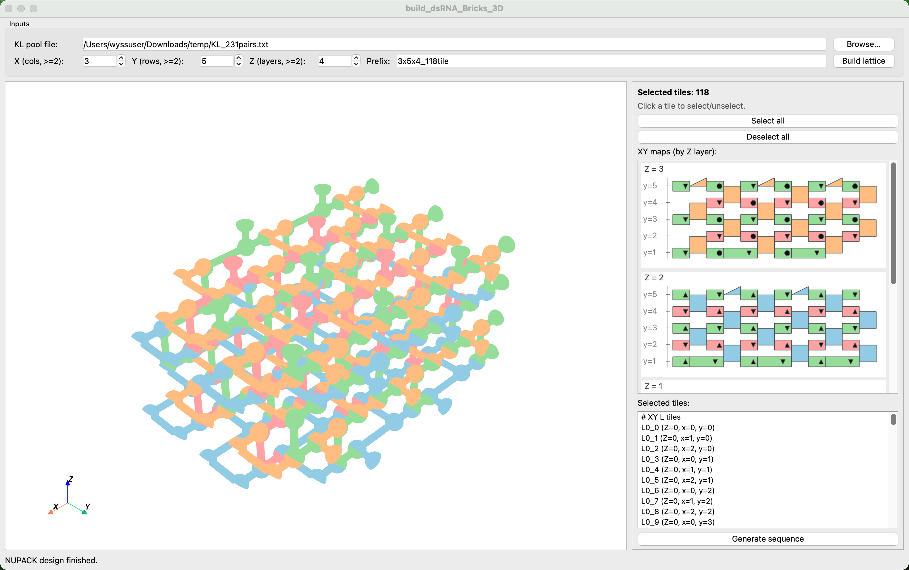
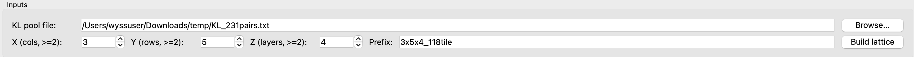
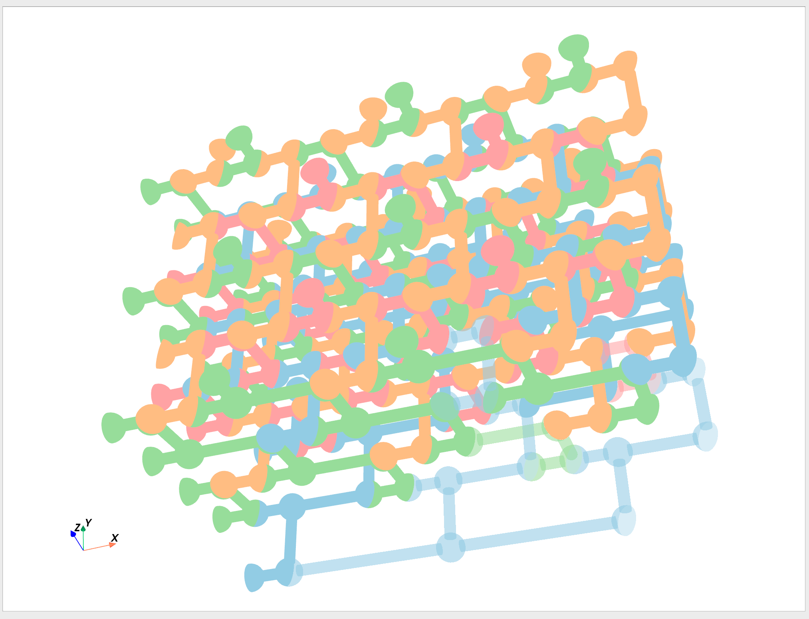
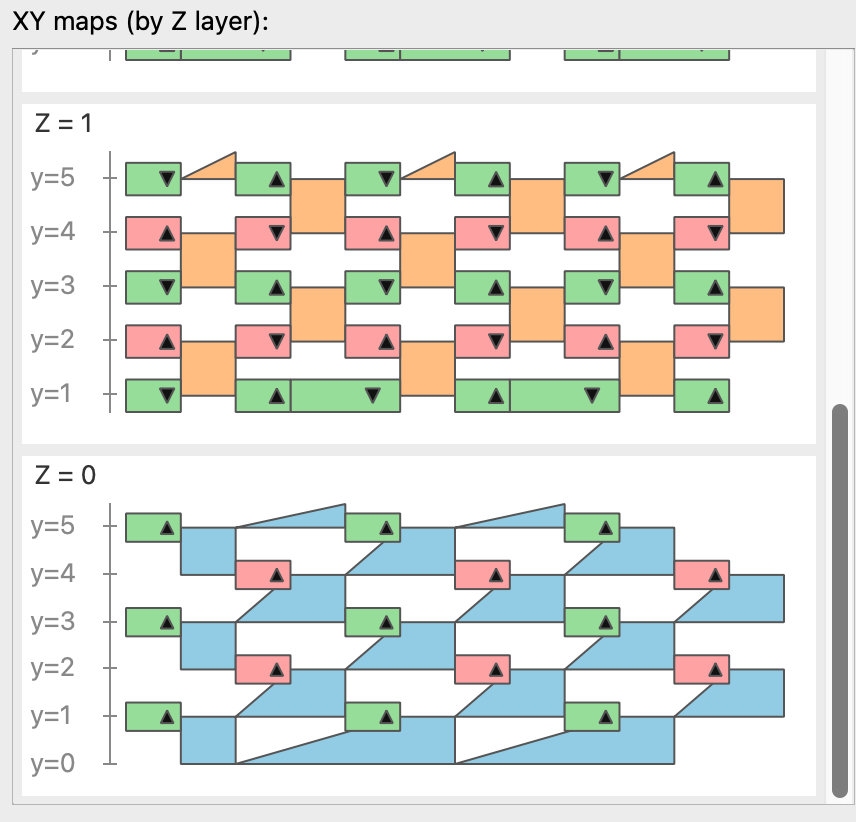
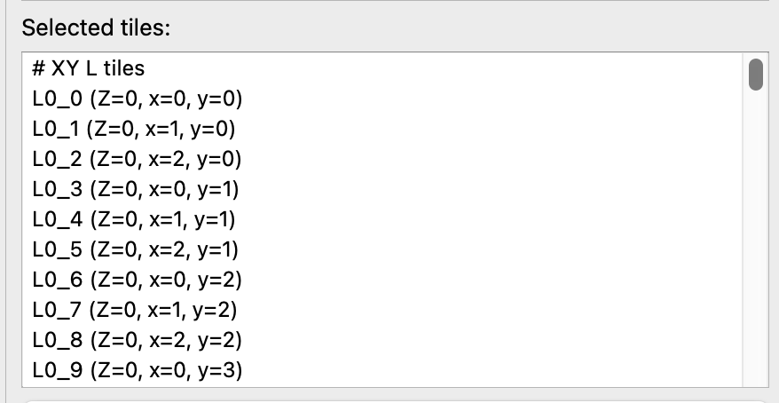
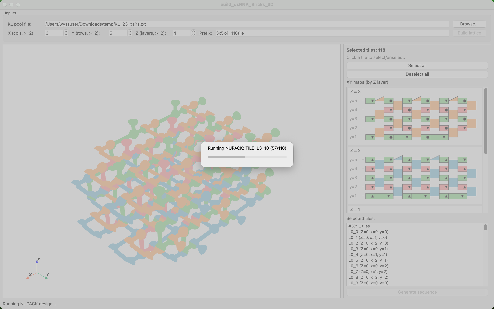
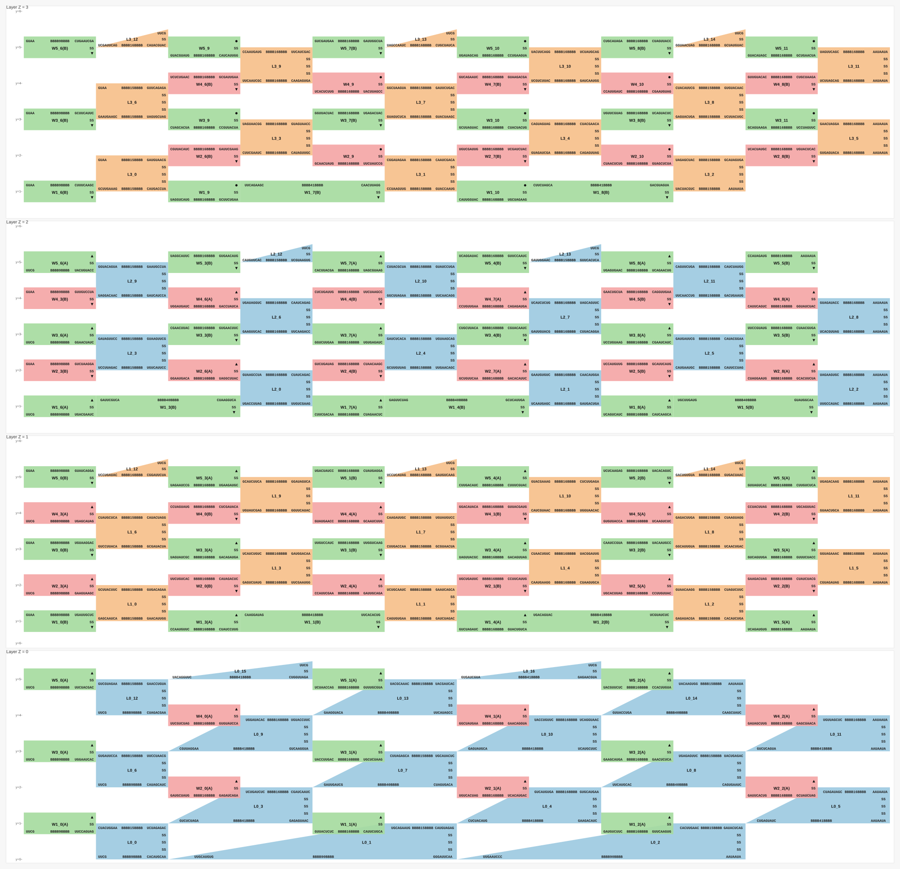

# Build 3D dsRNA Bricks

## Overview
This project is a Python GUI tool for designing and exporting 3D dsRNA brick lattices. It builds RNA nanostructures from predefined L/W tile modules, visualizes them in 3D and 2D, and generates sequence-design outputs for downstream optimization.

The workflow is:

1. Load a KL pair pool file.
2. Set lattice dimensions (`X`, `Y`, `Z`) and a prefix.
3. Build the 3D lattice.
4. Inspect and select tiles in synchronized 3D and 2D views.
5. Generate outputs for structure review and sequence design.

Current outputs:

- `<prefix>_tile_structure.txt`
- `<prefix>_2D_map.svg`
- `<prefix>_sequence.txt`

## Requirements
Python:

- Python `3.12` (tested)

Core packages:

- `PySide6==6.9.*` (recommended)
- `numpy`
- `pyvista`
- `pyvistaqt`
- `vtk` (tested with `9.5.2`)

Sequence design package:

- `nupack` (install/configure by following the official documentation: [https://docs.nupack.org/](https://docs.nupack.org/))

Installation demo (conda + pip):

```bash
conda create -n dsrna python=3.12 -y
conda activate dsrna
pip install "pyside6==6.9.*" numpy pyvista pyvistaqt vtk
```

Optional quick check:

```bash
python -c "import PySide6, pyvista, pyvistaqt, vtk, numpy; print('PySide6', PySide6.__version__); print('PyVista', pyvista.__version__); print('VTK', vtk.vtkVersion.GetVTKVersion()); print('NumPy', numpy.__version__)"
```

For NUPACK setup and installation, follow:

- [NUPACK Documentation](https://docs.nupack.org/)

## Run
From this folder:

```bash
python build_dsRNA_Bricks_3D.py
```

Alternative:

```bash
python -m function.build_dsRNA_Bricks_3D
```

## Project Layout
- `build_dsRNA_Bricks_3D.py`: top-level launcher.
- `function/app.py`: main GUI window and workflow wiring.
- `function/lattice_builder.py`: lattice/tile placement rules.
- `function/map2d.py`: 2D XY layer map widgets and selection.
- `function/view3d.py`: embedded PyVista 3D renderer.
- `function/c_tiles.py`: tile geometry definitions.
- `function/rna_tile_generator.py`: Type I / Type II RNA scaffold generation.
- `function/nupack_runner.py`: NUPACK run pipeline for generated tiles.
- `KL_231pairs.txt`: example KL pair pool file.
- `demo_2x3x2_23tile/`: demo run outputs for a `2x3x2` lattice.
- `demo_3x5x4_118tile/`: demo run outputs for a `3x5x4` lattice.

## Workflow Example (3x5x4, 118 tiles)
1. Overview  
   This example builds a `3x5x4` lattice (`118` tiles total).

   

2. Input  
   Choose a KL pair pool file. Here we use `KL_231pairs.txt`.

   Example lines from `KL_231pairs.txt`:

   ```text
   CUAGAUGGA	GAUCUACCU
   UGUACCUUC	ACAUGGAAG
   UCAGAUUCG	AGUCUAAGC
   GCAUGAGUA	CGUACUCAU
   GCUCAUCUA	CGAGUAGAU
   UAGCCAUUC	AUCGGUAAG
   GUUAGAACG	CAAUCUUGC
   CCUUAGUUG	GGAAUCAAC
   ```

   Set `X=3`, `Y=5`, `Z=4`, and optional prefix.  
   The required KL pair count for the selected lattice must be smaller than or equal to the pool size.

   

3. Build the lattice  
   Click `Build lattice`. The GUI generates both the 3D structure and the layered 2D map.

   3D self-assembly view:

   

   2D layered map:

   

4. Select tiles  
   Select/deselect from either the 3D view or 2D map. Selection is synchronized and shown in the right-side list.

   Selection rules before sequence generation:

   - No flexible tiles: each selected tile must have at least 2 interactions with other selected tiles.
   - Single connected group only: selected tiles must form one connected component (no multiple closed groups).

   

5. Generate sequence  
   Click `Generate sequence` to run sequence generation and NUPACK design for selected tiles.
   Runtime depends on lattice size; for the `118`-tile case it is around 5 minutes.

   

## Output Example (3x5x4_118tile)
1. 2D map  
   `demo_3x5x4_118tile/3x5x4_118tile_2D_map.svg` shows KL pair assignment on all tiles and layers.

   

2. Tile structure output  
   `demo_3x5x4_118tile/3x5x4_118tile_tile_structure.txt` contains tile scaffold sequences (with `N` placeholders) and designed dot-bracket secondary structures after KL pair assignment.

   <details>
   <summary>First three tiles</summary>

   ```text
   *******TILE_L0_0*******
   GNNNNNNUNNNNNNA GUUAGAACG NNNNNNNUNNNNNNC AAA UCGAUCUAC GNNNNNNGNNNNNNN ANNNNNNGNNNNNNC GNNNNNNUNNNA CGUAUGAAC NNNNNNNNC UUCG GNNNNNNNN NNNNGNNNNNNC UU CACGAAGUCAAUAC
   ((((((((((((((. ......... ((((((((((((((( ... ......... ))))))))))))))) .)))))))))))))) (((((((((((. ......... ((((((((( .... ))))))))) .))))))))))) .. ..............

   *******TILE_L0_1*******
   CNNNNNNGNNNNNNA AACAUGAGC NNNNNNNGNNNNNNC AAA AUCUCACUG GNNNNNNUNNNNNNN ANNNNNNUNNNNNNG GNNNNNNGNNNA GGUCUUGUA NNNNNNNGNNNNNNNGNNNNNNNUNNNNNNNGNNNNNNNUNNNNNNNGNNNNNNNUNNNNNNNUNNNNNNNGNNNNNNNUNNNNNNNUNC AAA GCAUACUUG GNGNNNNNNNGNNNNNNNUNNNNNNNGNNNNNNNGNNNNNNNUNNNNNNNGNNNNNNNUNNNNNNNGNNNNNNNUNNNNNNNUNNNNNNN ANNNUNNNNNNC UU CACGAAGUCAAUAC
   ((((((((((((((. ......... ((((((((((((((( ... ......... ))))))))))))))) .)))))))))))))) (((((((((((. ......... (((((((((((((((((((((((((((((((((((((((((((((((((((((((((((((((((((((((((((((((((((((((((( ... ......... )))))))))))))))))))))))))))))))))))))))))))))))))))))))))))))))))))))))))))))))))))))))))) .))))))))))) .. ..............

   *******TILE_L0_2*******
   GNNNNNNGNNNNNNA CAUGCAUAG NNNNNNNUNNNNNNC AAA GACGUAAGA GNNNNNNGNNNNNNN ANNNNNNUNNNNNNC CNNNNNNUNNNN AAUAAUA NNNNNNNUNNNNNNNGNNNNNNNGNNNNNNNGNNNNNNNUNNNNNNNUNNNNNNNGNNNNNNNUNNNNNNNUNNNNNNNUNNNNNNNUNG AAA CCAGAACAU CNGNNNNNNNGNNNNNNNGNNNNNNNGNNNNNNNUNNNNNNNGNNNNNNNGNNNNNNNUNNNNNNNUNNNNNNNUNNNNNNNGNNNNNNN ANNNGNNNNNNG UU CACGAAGUCAAUAC
   ((((((((((((((. ......... ((((((((((((((( ... ......... ))))))))))))))) .)))))))))))))) (((((((((((. ....... (((((((((((((((((((((((((((((((((((((((((((((((((((((((((((((((((((((((((((((((((((((((((( ... ......... )))))))))))))))))))))))))))))))))))))))))))))))))))))))))))))))))))))))))))))))))))))))))) .))))))))))) .. ..............
   ```
   </details>

3. Final sequence output  
   `demo_3x5x4_118tile/3x5x4_118tile_sequence.txt` contains, for each tile:  
   `input scaffold sequence -> input dot-bracket secondary structure -> NUPACK-designed full sequence`.

   <details>
   <summary>First three tiles</summary>

   ```text
   *******TILE_L0_0*******

   GNNNNNNUNNNNNNA GUUAGAACG NNNNNNNUNNNNNNC AAA UCGAUCUAC GNNNNNNGNNNNNNN ANNNNNNGNNNNNNC GNNNNNNUNNNA CGUAUGAAC NNNNNNNNC UUCG GNNNNNNNN NNNNGNNNNNNC UU CACGAAGUCAAUAC

   ((((((((((((((. ......... ((((((((((((((( ... ......... ))))))))))))))) .)))))))))))))) (((((((((((. ......... ((((((((( .... ))))))))) .))))))))))) .. ..............

   GGCGCUCUGCUGCCA GUUAGAACG GACCUGCUGCUCCGC AAA UCGAUCUAC GCGGAGCGGCAGGUC AGGCAGCGGAGUGCC GCUGCGGUAUCA CGUAUGAAC GGCUCAGGC UUCG GCCUGGGCC AGAUGCCGCAGC UU CACGAAGUCAAUAC


   *******TILE_L0_1*******

   CNNNNNNGNNNNNNA AACAUGAGC NNNNNNNGNNNNNNC AAA AUCUCACUG GNNNNNNUNNNNNNN ANNNNNNUNNNNNNG GNNNNNNGNNNA GGUCUUGUA NNNNNNNGNNNNNNNGNNNNNNNUNNNNNNNGNNNNNNNUNNNNNNNGNNNNNNNUNNNNNNNUNNNNNNNGNNNNNNNUNNNNNNNUNC AAA GCAUACUUG GNGNNNNNNNGNNNNNNNUNNNNNNNGNNNNNNNGNNNNNNNUNNNNNNNGNNNNNNNUNNNNNNNGNNNNNNNUNNNNNNNUNNNNNNN ANNNUNNNNNNC UU CACGAAGUCAAUAC

   ((((((((((((((. ......... ((((((((((((((( ... ......... ))))))))))))))) .)))))))))))))) (((((((((((. ......... (((((((((((((((((((((((((((((((((((((((((((((((((((((((((((((((((((((((((((((((((((((((((( ... ......... )))))))))))))))))))))))))))))))))))))))))))))))))))))))))))))))))))))))))))))))))))))))))) .))))))))))) .. ..............

   CGGUGAUGGUGCGGA AACAUGAGC CGUCAUGGAUGCGGC AAA AUCUCACUG GCCGUAUUCGUGACG ACCGUACUAUCGCUG GCCAAUGGUGCA GGUCUUGUA GGGUCAAGGCAGUGCGGUAACUUUGAGCCGUGUCUACGCUGUGCAUUGGCUCCGGUAGGCUCGUUUCAUUAGUGAUCUUUGACAAGGUUC AAA GCAUACUUG GAGCCUUGUCGAGGAUCAUUGAUGAGGCGAGCUUGCCGGAGUUAAUGCACGGCGUAGAUACGGUUCGAAGUUGCUGCAUUGCUUUGACCC AGCAUCAUUGGC UU CACGAAGUCAAUAC


   *******TILE_L0_2*******

   GNNNNNNGNNNNNNA CAUGCAUAG NNNNNNNUNNNNNNC AAA GACGUAAGA GNNNNNNGNNNNNNN ANNNNNNUNNNNNNC CNNNNNNUNNNN AAUAAUA NNNNNNNUNNNNNNNGNNNNNNNGNNNNNNNGNNNNNNNUNNNNNNNUNNNNNNNGNNNNNNNUNNNNNNNUNNNNNNNUNNNNNNNUNG AAA CCAGAACAU CNGNNNNNNNGNNNNNNNGNNNNNNNGNNNNNNNUNNNNNNNGNNNNNNNGNNNNNNNUNNNNNNNUNNNNNNNUNNNNNNNGNNNNNNN ANNNGNNNNNNG UU CACGAAGUCAAUAC

   ((((((((((((((. ......... ((((((((((((((( ... ......... ))))))))))))))) .)))))))))))))) (((((((((((. ....... (((((((((((((((((((((((((((((((((((((((((((((((((((((((((((((((((((((((((((((((((((((((((( ... ......... )))))))))))))))))))))))))))))))))))))))))))))))))))))))))))))))))))))))))))))))))))))))))) .))))))))))) .. ..............

   GCGUGACGUUCGCCA CAUGCAUAG CCGCUUCUGCUUGGC AAA GACGUAAGA GCCAAGCGGAAGCGG AGGCGGAUGUCACGC CCUAGCAUGCCG AAUAAUA GGUGAGAUAGUUGGCGCUAGCGAGCGGUAGGGACGGUGCUGUAGGCCUGUAGUCCGGCACAUGUCCGUACGUCAGCGUGUUCGGUAUUGG AAA CCAGAACAU CCGAUGCCGAGCGCGUUGGCGUACGGGCAUGUGCUGGACUACGGGUCUACGGCACCGUUCUUACCGUUCGCUGGUGCCGACUGUCUCACC AGGCGUGCUAGG UU CACGAAGUCAAUAC
   ```
   </details>

## Sequence Generation Notes
- Generation uses selected tiles only.
- Validation checks include:
  - KL pair pool availability.
  - No flexible tiles: each selected tile must have at least 2 interactions.
  - Single connected group only (no multiple closed groups).
- `Generate sequence` exports the three output files listed above and runs NUPACK with a progress dialog.

## NUPACK Design Principles
- RNA model with `some-nupack3` ensemble, at `37°C` and `1.0 M` sodium.
- Soft pattern-avoidance (weight `1.0`) for: `A4`, `C4`, `G4`, `U4`, `K6`, `M6`, `R6`, `S6`, `W6`, `Y6`.
- Sequence optimization stop condition: `f_stop = 0.02`.
- Each tile design runs `3` rounds (trials), and the best result is selected.

## Reproducibility
- KL pair assignment is randomized with a fixed seed (`42`) to make runs reproducible.
- With the same KL pair pool file, lattice size (`X`, `Y`, `Z`), and tile selection, the assignment/order is deterministic.

## File Format Mini-Spec
1. KL pair pool file (`KL_231pairs.txt` style)
   - One pair per line.
   - Two RNA sequences separated by a tab.
   - Example:

   ```text
   CUAGAUGGA	GAUCUACCU
   UGUACCUUC	ACAUGGAAG
   ```

2. Tile structure output (`<prefix>_tile_structure.txt`)
   - Repeated tile blocks in this order:
     - tile header line: `*******TILE_NAME*******`
     - tile scaffold sequence (with `N` placeholders and spacing groups)
     - dot-bracket secondary structure (with spacing groups)

3. Final sequence output (`<prefix>_sequence.txt`)
   - Repeated tile blocks in this order:
     - tile header line
     - input scaffold sequence
     - input dot-bracket secondary structure
     - NUPACK-designed final full sequence

## Troubleshooting
1. Qt window does not show or hangs on startup
   - Confirm PySide6 version:
     - recommended: `6.9.*`
   - Check version:

   ```bash
   python -c "import PySide6; print(PySide6.__version__)"
   ```

2. 3D rendering/picking issues
   - Reinstall GUI/render stack in the active env:

   ```bash
   pip install --upgrade "pyside6==6.9.*" pyvista pyvistaqt vtk
   ```

3. NUPACK step fails
   - Verify NUPACK installation in the same Python environment used to run the GUI:

   ```bash
   python -c "import nupack; print('nupack ok')"
   ```

   - If import fails, follow the official setup guide:
     - [NUPACK Documentation](https://docs.nupack.org/)
